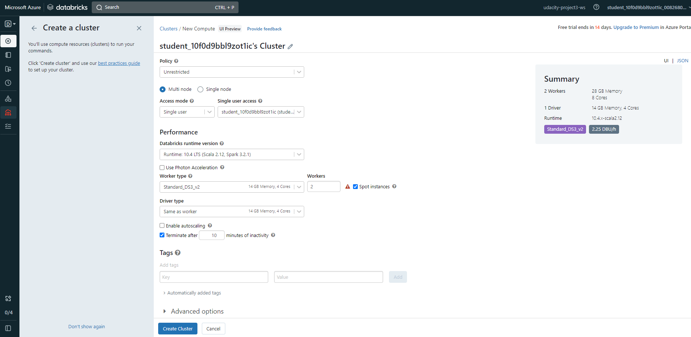
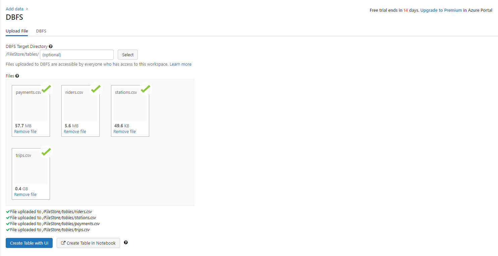
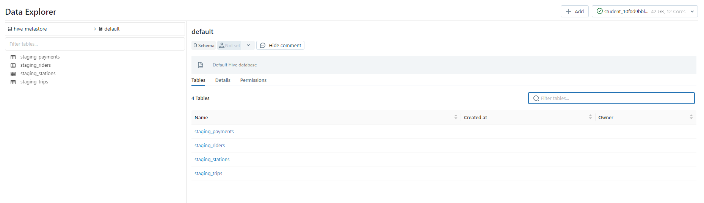
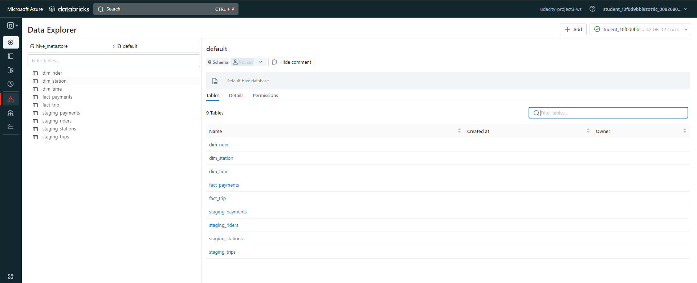

# Building an Azure Data Lake for Bike Share Data Analytics
# Submitter - Quyet, Nguyen

In this project, you'll build a data lake solution for Divvy bikeshare.

Divvy is a bike sharing program in Chicago, Illinois USA that allows riders to purchase a pass at a kiosk or use a mobile application to unlock a bike at stations around the city and use the bike for a specified amount of time. The bikes can be returned to the same station or to another station. The City of Chicago makes the anonymized bike trip data publicly available for projects like this where we can analyze the data.

Since the data from Divvy are anonymous, we have generated fake rider and account profiles along with fake payment data to go along with the data from Divvy. The dataset looks like this:

The goal of this project is to develop a data lake solution using Azure Databricks using a lake house architecture. We will:
- Design a star schema based on the business outcomes listed below
- Import the data into Azure Databricks using Delta Lake to create a Bronze data store
- Create a gold data store in Delta Lake tables
- Transform the data into the star schema for a Gold data store;

## The business outcomes we are designing for are as follows:
### 1. Analyze how much time is spent per ride
- Based on date and time factors such as day of week and time of day
- Based on which station is the starting and / or ending station
- Based on age of the rider at time of the ride
- Based on whether the rider is a member or a casual rider
### 2. Analyze how much money is spent
- Per month, quarter, year
- Per member, based on the age of the rider at account start
### 3. Analyze how much money is spent per member
- Based on how many rides the rider averages per month
- Based on how many minutes the rider spends on a bike per month

# TASK NEED TO COMPLETE

## Task 1: Design Bikeshare Star Schema

Below is our star schema:

## Task 2: Import the data into Azure Databricks using Delta Lake to create a Bronze data store

1. Create Azure Databricks Workspace

2. Create Databricks Cluster

3. Import data to DBFS path <b>/FileStore/tables/</b>

4. Create a gold data store in Delta Lake tables by using Databricks Python notebook

4 tables already loaded in hive_metastore default schema:

5. Transform Delta source tables into designed star schema (dim/fact tables)

Dimension and fact tables already loaded in hive_metastore default schema:

